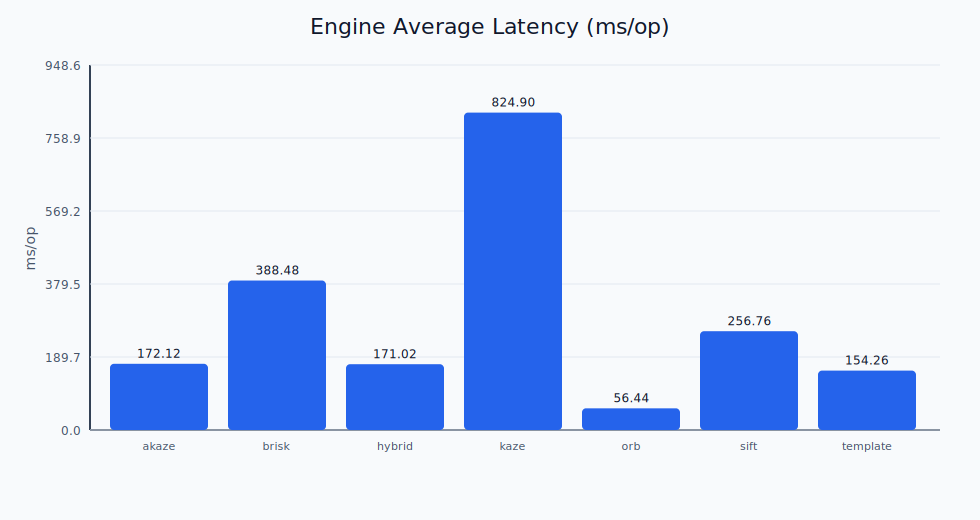
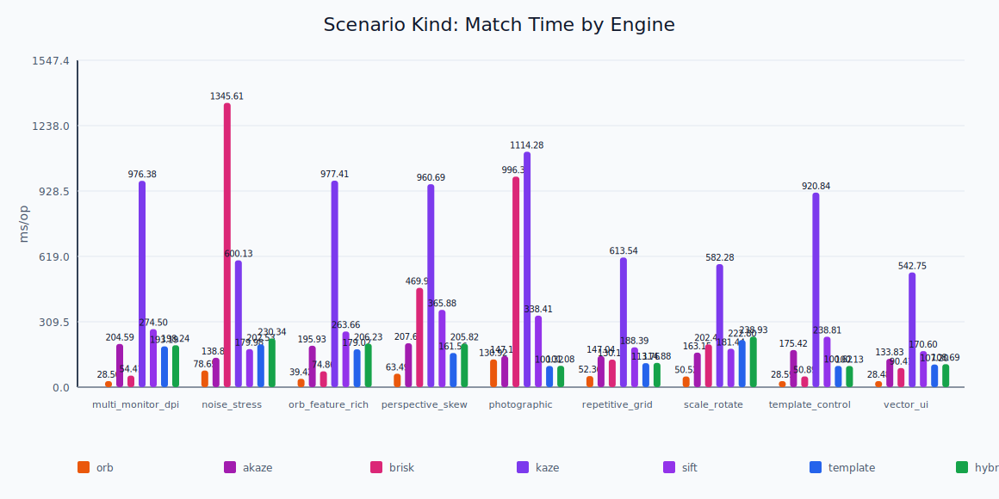
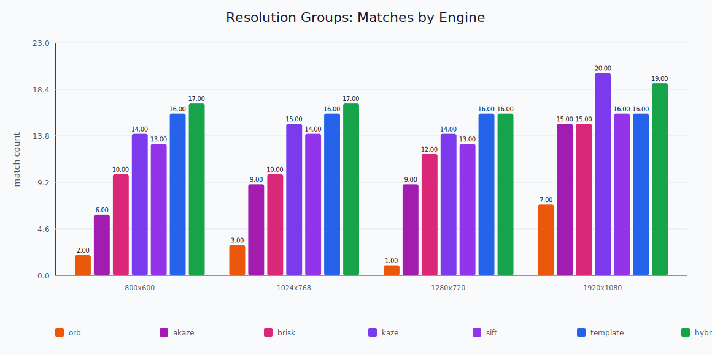
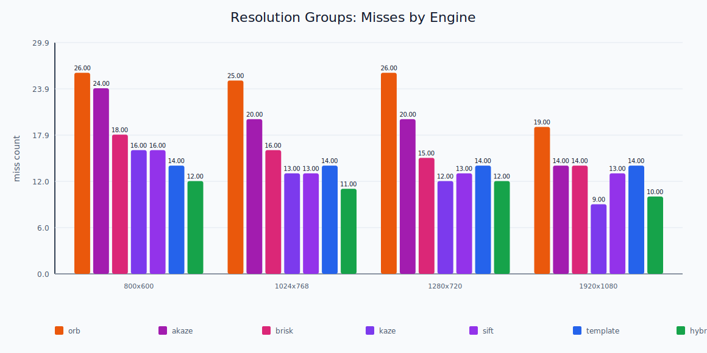
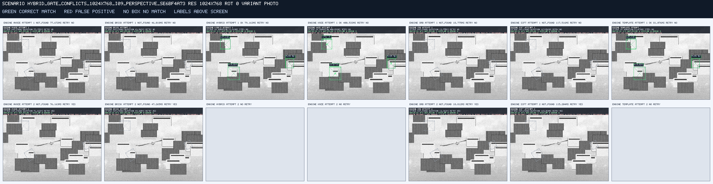
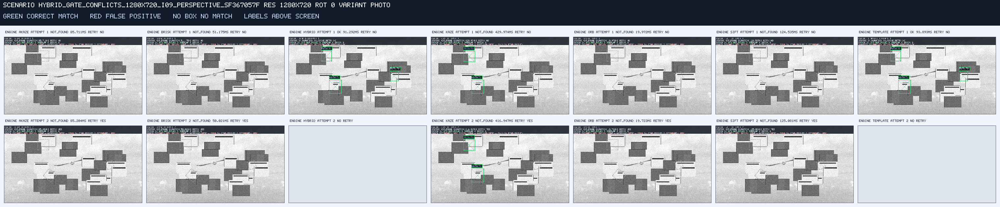
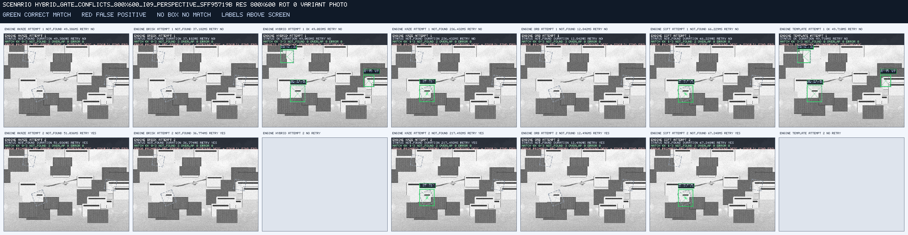
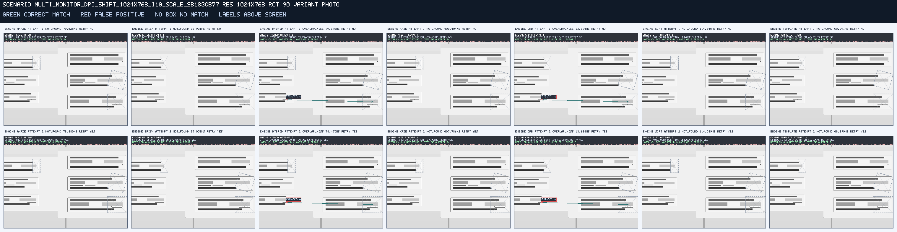
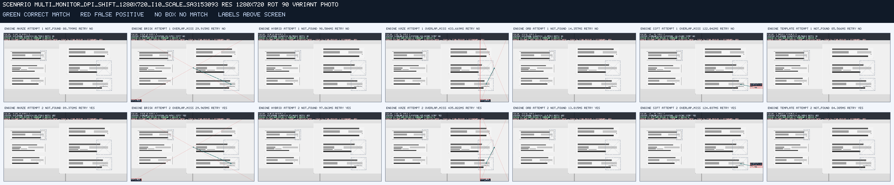

# sikuligo (Node.js)

SikuliGO is a GoLang implementation of Sikuli visual automation. This package provides the Node.js SDK for launching `sikuligo` locally and executing automation with a small API surface.

## Links

- Main repository: [github.com/smysnk/SikuliGO](https://github.com/smysnk/SikuliGO)
- API reference: [smysnk.github.io/SikuliGO/reference/api](https://smysnk.github.io/SikuliGO/reference/api/)
- Node user flow: [smysnk.github.io/SikuliGO/guides/node-package-user-flow](https://smysnk.github.io/SikuliGO/guides/node-package-user-flow)
- Client strategy: [smysnk.github.io/SikuliGO/strategy/client-strategy](https://smysnk.github.io/SikuliGO/strategy/client-strategy)
- Architecture docs: [Port Strategy](https://smysnk.github.io/SikuliGO/strategy/port-strategy), [gRPC Strategy](https://smysnk.github.io/SikuliGO/strategy/grpc-strategy), [Java Parity Map](https://smysnk.github.io/SikuliGO/reference/parity/java-to-go-mapping)

## Quickstart

`init:js-examples` prompts for a target directory, scaffolds a `package.json` with the latest `@sikuligo/sikuligo` dependency, runs `yarn install`, and copies `.mjs` examples into `examples/`.

```bash
yarn dlx @sikuligo/sikuligo init:js-examples
cd sikuligo-demo
yarn node examples/click.mjs
```

```js
import { Screen, Pattern } from "@sikuligo/sikuligo";

const screen = await Screen();
try {
  const match = await screen.click(Pattern("assets/pattern.png").exact());
  console.log(`clicked match target at (${match.targetX}, ${match.targetY})`);
} finally {
  await screen.close();
}
```

## Web Dashboard
```bash
yarn dlx @sikuligo/sikuligo -listen 127.0.0.1:50051 -admin-listen :8080
```

Open:

- http://127.0.0.1:8080/dashboard

Additional endpoints:

- http://127.0.0.1:8080/healthz
- http://127.0.0.1:8080/metrics
- http://127.0.0.1:8080/snapshot

Install permanently on PATH:

```bash
yarn dlx @sikuligo/sikuligo install-binary
source ~/.zshrc
# or
source ~/.bash_profile
```

<!-- BEGIN: FIND_ON_SCREEN_BENCH_AUTOGEN -->
## FindOnScreen Benchmark Test Results

Generated: `2026-03-05T02:07:33.586150+00:00`

### Reports

- [Markdown Summary](../../docs/bench/reports/find-on-screen-e2e.md)
- [JSON Report](../../docs/bench/reports/find-on-screen-e2e.json)
- [Raw go test Output](../../docs/bench/reports/find-on-screen-e2e.txt)
- [Performance SVG](../../docs/bench/reports/find-on-screen-performance.svg)
- [Accuracy SVG](../../docs/bench/reports/find-on-screen-accuracy.svg)
- [Scenario Kind Match Time SVG](../../docs/bench/reports/find-on-screen-kind-time.svg)
- [Scenario Kind Success SVG](../../docs/bench/reports/find-on-screen-kind-success.svg)
- [Resolution Match Time SVG](../../docs/bench/reports/find-on-screen-resolution-time.svg)
- [Resolution Matches SVG](../../docs/bench/reports/find-on-screen-resolution-matches.svg)
- [Resolution Misses SVG](../../docs/bench/reports/find-on-screen-resolution-misses.svg)
- [Resolution False Positives SVG](../../docs/bench/reports/find-on-screen-resolution-false-positives.svg)

### Engine Summary

_Cases/OK metrics are query-level counts (regions x scenarios x resolutions), not just benchmark row count._

| Engine | Cases | OK | Partial | Not Found | Unsupported | Error | Overlap Miss | Avg ms/op | Median ms/op |
|---|---:|---:|---:|---:|---:|---:|---:|---:|---:|
| akaze | 120 | 60 | 0 | 59 | 0 | 0 | 1 | 156.363 | 129.667 |
| brisk | 120 | 65 | 0 | 47 | 0 | 0 | 8 | 324.128 | 108.255 |
| hybrid | 120 | 90 | 0 | 29 | 0 | 0 | 1 | 138.714 | 89.644 |
| kaze | 120 | 75 | 0 | 38 | 0 | 0 | 7 | 734.329 | 574.720 |
| orb | 120 | 37 | 0 | 73 | 0 | 0 | 10 | 47.998 | 35.355 |
| sift | 120 | 75 | 0 | 43 | 0 | 0 | 2 | 234.052 | 186.955 |
| template | 120 | 72 | 0 | 48 | 0 | 0 | 0 | 119.155 | 84.458 |

### Run Mega Summary


- [Open run mega summary image](../../docs/bench/reports/visuals/summaries/summary-run-mega.jpg)

### Benchmark Graphs



- [Open performance graph](../../docs/bench/reports/find-on-screen-performance.svg)


- [Open accuracy graph](../../docs/bench/reports/find-on-screen-accuracy.svg)

### Scenario Kind Graphs



- [Open scenario kind match time graph](../../docs/bench/reports/find-on-screen-kind-time.svg)


- [Open scenario kind success graph](../../docs/bench/reports/find-on-screen-kind-success.svg)

### Resolution Group Graphs


- [Open resolution match time graph](../../docs/bench/reports/find-on-screen-resolution-time.svg)



- [Open resolution matches graph](../../docs/bench/reports/find-on-screen-resolution-matches.svg)



- [Open resolution misses graph](../../docs/bench/reports/find-on-screen-resolution-misses.svg)


- [Open resolution false positives graph](../../docs/bench/reports/find-on-screen-resolution-false-positives.svg)

### Artifact Directories

- [Visual Root Directory](../../docs/bench/reports/visuals)
- [Scenario Summaries Directory](../../docs/bench/reports/visuals/summaries)
- [Attempt Images Directory](../../docs/bench/reports/visuals/attempts)

### Scenario Summary Images (40)

#### `hybrid_gate_conflicts_1024x768_i09`



- [Open `hybrid_gate_conflicts_1024x768_i09` image](../../docs/bench/reports/visuals/summaries/summary-hybrid_gate_conflicts_1024x768_i09.png)

#### `hybrid_gate_conflicts_1280x720_i09`



- [Open `hybrid_gate_conflicts_1280x720_i09` image](../../docs/bench/reports/visuals/summaries/summary-hybrid_gate_conflicts_1280x720_i09.png)

#### `hybrid_gate_conflicts_1920x1080_i09`


- [Open `hybrid_gate_conflicts_1920x1080_i09` image](../../docs/bench/reports/visuals/summaries/summary-hybrid_gate_conflicts_1920x1080_i09.png)

#### `hybrid_gate_conflicts_800x600_i09`



- [Open `hybrid_gate_conflicts_800x600_i09` image](../../docs/bench/reports/visuals/summaries/summary-hybrid_gate_conflicts_800x600_i09.png)

#### `multi_monitor_dpi_shift_1024x768_i10`



- [Open `multi_monitor_dpi_shift_1024x768_i10` image](../../docs/bench/reports/visuals/summaries/summary-multi_monitor_dpi_shift_1024x768_i10.png)

#### `multi_monitor_dpi_shift_1280x720_i10`



- [Open `multi_monitor_dpi_shift_1280x720_i10` image](../../docs/bench/reports/visuals/summaries/summary-multi_monitor_dpi_shift_1280x720_i10.png)

- 34 additional scenario images available in the summaries directory.

<!-- END: FIND_ON_SCREEN_BENCH_AUTOGEN -->
